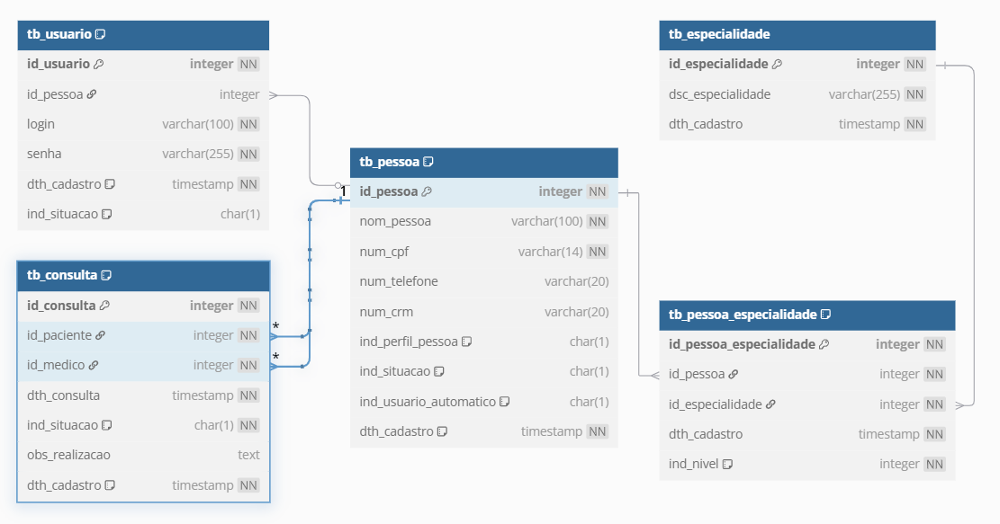

# Poo Test

Projeto apresentado como requisito para dispensa na disciplina.

## Critérios de Avaliação

* Utilizar classes abstratas, classes não abstratas, e interfaces;
    * [Classe abstrata] (./src/main/java/com/marina/model/Person.java);
    * [Classe não abstrata] (./src/main/java/com/marina/model/Patient.java);
    * [Interface] (./src/main/java/com/marina/view/AuthView.java);
* Uso adequado da OO: classes e encapsulamento;
* Uso de construtores;
* [Aplicação do conceito de herança] (./src/main/java/com/marina/model/Patient.java);
* [Uso de Polimorfismo] (./src/main/java/com/marina/model/Patient.java);
* [Uso de Collections] (./src/main/java/com/marina/services/AppointmentService.java);
* [Uso de Testes Unitários automatizados para cada regra de negócio (BO) e acesso ao BD (DAO)] (./src/test/java/com/marina);
* Utilizar ao menos 2 padrões de projeto e explicar onde está sendo aplicado;
    * [Singleton] (./src/main/java/com/marina/config/AppConfig.java);
    * [Factory] (./src/main/java/com/marina/factory/PersonFactory.java);
* Uso de banco de dados (insert, update, delete, select);
* Estruturação do projeto em camadas (View, BO, VO, DAO);
* [Uso de exceções (deve-se cria exceções próprias e tratá-las corretamente)] (./src/main/java/com/marina/exception);

## Design Patterns

* Singleton
* Factory

## Relacional

